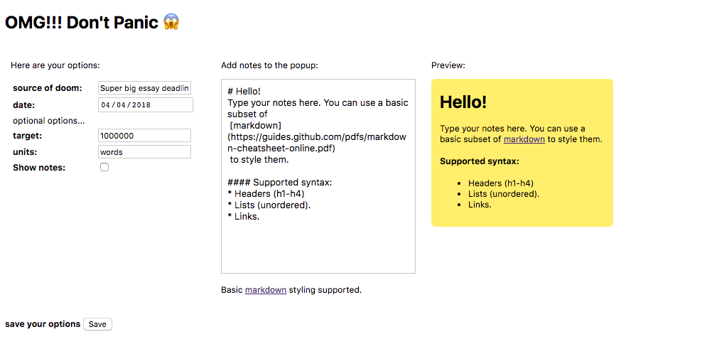

# OMG!!! Don't Panic :scream:

Chrome extension to remind yourself of incoming project deadlines in a friendly way. Display’s a popup countdown timer to the deadline with some additional optional information.

## Installation
Download this repository.

With a Chrome browser, open the extensions page located at: `chrome://extensions` and drag and drop the `src` folder from the downloaded repo into the webpage.

## Features
Options page displays list of available options. Comes with its own markdown parser, because writing a markdown parser was obviously not someone procrastinating.

#### Supported markdown syntax

	# h1
    ## h2
    ### h3
    #### h4

    * lists

    [links](link_url)
